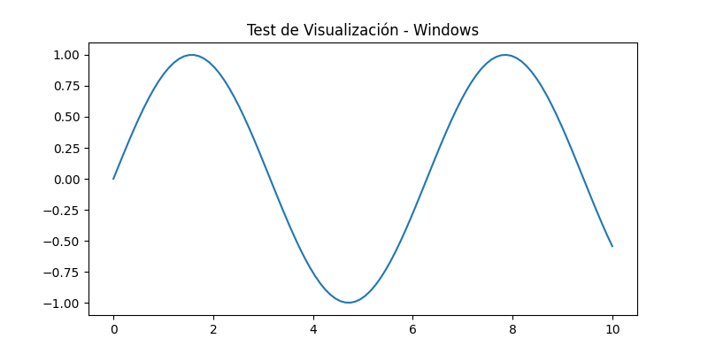

# Hola, soy José Manuel Castro Reina 👋

## 🛠️ Perfil IT y Ciencia de Datos
Profesional en reconversión al área IT, especializado en **Python** y **Desarrollo Web**. Actualmente curso la Tecnicatura en Ciencia de Datos e IA en el **IFTS 12**.

### 💻 Mi Entorno de Desarrollo
Opero con un entorno híbrido sincronizado entre **Windows 11** (PC de escritorio) y **macOS** (MacBook), utilizando entornos virtuales (`venv`) y **VS Code** con sincronización en la nube.

#### Prueba de Rendimiento y Visualización:
Este gráfico fue generado automáticamente tras la configuración y validación de mis librerías de Ciencia de Datos (**Pandas, Seaborn, Matplotlib**):

---
### 🚀 Stack Tecnológico:
- **Lenguajes:** Python (Flask, Data Science Stack), Node.js, HTML/CSS.
- **Bases de Datos:** MySQL, SQLite.
- **Herramientas:** Git, GitHub, Docker (próximamente), Linux Terminal.
- **Especialidad:** Soporte técnico integral (Hardware/Software) y CCTV.
