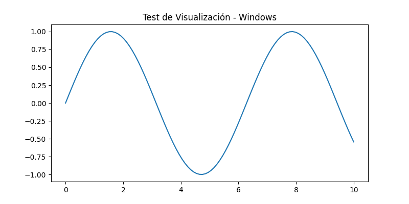

``
# Hola, soy José Manuel Castro Reina 👋

## 🛠️ Perfil IT y Ciencia de Datos
Profesional en reconversión al área IT, especializado en **Python** y **Desarrollo Web**. Actualmente curso la Tecnicatura en Ciencia de Datos e IA en el **IFTS 12**.

### 💻 Mi Entorno de Desarrollo
Opero con un entorno híbrido sincronizado entre **Windows 11** (PC de escritorio) y **macOS** (MacBook), utilizando entornos virtuales (`venv`) y **VS Code** con sincronización en la nube.

#### Prueba de Rendimiento y Visualización:
Este gráfico fue generado automáticamente tras la configuración y validación de mis librerías de Ciencia de Datos (**Pandas, Seaborn, Matplotlib**):

---
### 🚀 Stack Tecnológico:
- **Lenguajes:** Python (Flask, Data Science Stack), Node.js, HTML/CSS.
- **Bases de Datos:** Oracle, MySQL, SQLite.
- **Herramientas:** Git, GitHub, Docker (próximamente), Linux Terminal.
- **Especialidad:** Soporte técnico integral (Hardware/Software) y CCTV.
``
  
# ¡Hola! Soy Jose Manuel Castro Reina 👋

### Estudiante de Ciencia de Datos e IA | Desarrollador Back-End & Automatizaciones
Me encuentro cursando el 2.° año de la **Tecnicatura Superior en Ciencia de Datos e Inteligencia Artificial** en el **IFTS 12**. Me apasiona resolver problemas técnicos, modelar datos y optimizar flujos de trabajo mediante código y herramientas de automatización. 

A través de mi espacio de proyectos autónomos, **Lógica Digital**, diseño e implemento soluciones de software orientadas a necesidades reales de comercios y pymes.

---

## 🛠️ Tecnologías y Herramientas

### Lenguajes y Bases de Datos

### Ecosistema de Desarrollo y Automatización

---

## 🚀 Proyectos Destacados (Lógica Digital)

* **Inmobiliario-pro:** Plataforma para gestión de catálogos y administración inmobiliaria.
* **web-stetica:** Desarrollo web enfocado en la digitalización y gestión de turnos para centros de estética.
* **Automatizaciones & IA:** Flujos de trabajo y agentes lógicos creados con n8n e integración de modelos de lenguaje para optimización de procesos comerciales.

---

## 📊 Formación Académica

* **Tecnicatura Superior en Ciencia de Datos e Inteligencia Artificial** * *IFTS 12* | En curso (2.° año) | 2025 - Presente
* **Especializaciones Autónomas (Udemy / Autodidacta)**
    * Enfoque en entornos Back-End, modelado SQL, React.js y lógicas de automatización.

---

## ✉️ Contacto

* **Email:** [jcmanueldj@gmail.com](mailto:jcmanueldj@gmail.com)
* **Ubicación:** Buenos Aires, Argentina

Un gusto tenerte por acá. ¡Explorá mis repositorios para ver mis códigos de práctica de la carrera y proyectos personales!
